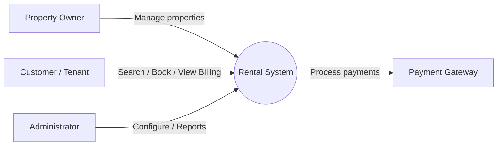
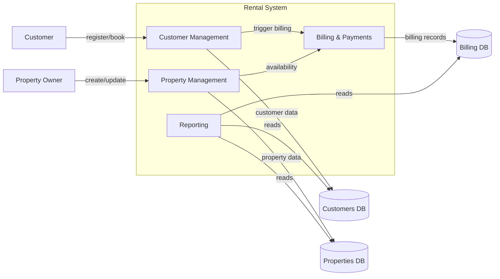
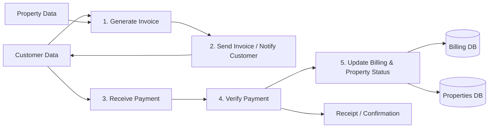

# rental-system

A lightweight property rental management system (no framework). This repository contains a simple HTTP server, a client-side SPA, and a SQLite database for properties and customers.

**DFD Diagrams**

**Level 0 (Context Diagram)**

This context diagram shows the `Rental System` as a single central process interacting with external actors.

**Level 1 DFD**

Breaks the central process into major sub-processes, data flows, and data stores.

**Level 2 DFD (Billing & Payments decomposition)**

Detailed view of the `Billing & Payments` subprocess showing invoice generation, payment processing, and updates to data stores.

Notes:
- GitHub renders Mermaid diagrams in Markdown; view these diagrams on GitHub or a compatible Markdown renderer.
- The diagrams show conceptual data flows; adapt them as needed to match implementation details.
# rental-system