# Rental System - Property Management Platform

A lightweight **property rental management system** built with **Python HTTP server** (no framework), **vanilla JavaScript frontend**, and **SQLite database**. This project demonstrates core web development concepts: REST APIs, client-side routing, database operations, and DOM manipulation.

---

## Table of Contents

1. [Project Overview](#project-overview)
2. [Architecture](#architecture)
3. [Database Schema](#database-schema)
4. [How to Run](#how-to-run)
5. [Project Features](#project-features)
6. [API Endpoints](#api-endpoints)
7. [How Each Page Works](#how-each-page-works)
8. [Key Code Patterns](#key-code-patterns)
9. [Data Flow Diagrams](#data-flow-diagrams)
10. [Troubleshooting](#troubleshooting)

---

## Project Overview

### What is this project?

This is a **property management system** that helps:
- **Property Owners** to add and manage properties
- **Administrators** to track customers and billing information
- **Users** to view property lists, book properties, and manage billing records

### Why no framework?

This project uses a custom Python HTTP server instead of Django/Flask to:
- ✅ Learn core HTTP concepts (GET, POST, DELETE)
- ✅ Understand REST API design from scratch
- ✅ Master client-side JavaScript routing (no server-side routing)
- ✅ Work with SQLite database directly
- ✅ Keep the codebase lightweight and educational

### Tech Stack Diagram


### Tech Stack Details

| Layer | Technology | Purpose |
|-------|-----------|---------|
| **Backend** | Python 3 + HTTPServer | Lightweight server, no framework needed |
| **Frontend** | HTML5, CSS3, Vanilla JavaScript | Pure web standards, no frameworks |
| **Database** | SQLite3 | Lightweight file-based database |
| **Reports** | jsPDF | Client-side PDF generation |
| **QR Codes** | QRCode.js | Generate QR codes for billing |
| **Documentation** | Plain text files | 160+ Q&A searchable via API |

---

## Use Case Diagram

```mermaid
graph LR
    PropertyOwner["🏠 Property Owner"]
    Administrator["👨‍💼 Administrator"]
    Tenant["👤 Tenant/User"]
    
    Dashboard["📊 View Dashboard<br/>See statistics"]
    AddProperty["➕ Add Property<br/>Add rentals"]
    ViewProperties["📋 View Properties<br/>Browse listings"]
    DeleteProperty["🗑️ Delete Property<br/>Remove listings"]
    
    AddCustomer["👥 Add Customer<br/>Register tenant"]
    ViewCustomers["📊 View Customers<br/>Tenant records"]
    DeleteCustomer["🗑️ Delete Customer<br/>Remove tenant"]
    
    ViewBilling["💳 View Billing<br/>Payment records"]
    ExportBilling["📄 Export Billing<br/>PDF/CSV reports"]
    SearchDocs["🔍 Search Docs<br/>Get answers"]
    
    PropertyOwner --> AddProperty
    PropertyOwner --> ViewProperties
    PropertyOwner --> DeleteProperty
    PropertyOwner --> Dashboard
    
    Administrator --> AddCustomer
    Administrator --> ViewCustomers
    Administrator --> DeleteCustomer
    Administrator --> ViewBilling
    Administrator --> ExportBilling
    
    Tenant --> ViewProperties
    Tenant --> ViewBilling
    Tenant --> SearchDocs
    
    style PropertyOwner fill:#fff3e0,stroke:#e65100,stroke-width:2px
    style Administrator fill:#f3e5f5,stroke:#4a148c,stroke-width:2px
    style Tenant fill:#e1f5fe,stroke:#0277bd,stroke-width:2px
    style Dashboard fill:#c8e6c9
    style AddProperty fill:#fff9c4
    style ViewProperties fill:#fff9c4
    style DeleteProperty fill:#ffccbc
    style AddCustomer fill:#f8bbd0
    style ViewCustomers fill:#f8bbd0
    style DeleteCustomer fill:#ffccbc
    style ViewBilling fill:#b2dfdb
    style ExportBilling fill:#b2dfdb
    style SearchDocs fill:#ffe0b2
```



---

## Architecture

### Three-Layer Architecture

```mermaid
graph LR
    User["👤 User<br/>(Browser)"]
    HTML["📄 HTML Templates<br/>(index.html, add_property.html, etc.)"]
    JS["⚙️ JavaScript<br/>(script.js)"]
    CSS["🎨 CSS Styling<br/>(style.css)"]
    Widget["💬 Chat Widget<br/>(AI Documentation)"]
    
    Server["🖥️ HTTP Server<br/>(Python app.py)"]
    RequestHandler["📨 Request Handler<br/>(GET/POST/DELETE)"]
    API["🔌 REST API<br/>(/api/properties, /api/billing, etc.)"]
    Search["🔍 PDF Search<br/>(/api/search-pdf)"]
    
    Database["💾 SQLite Database<br/>(database.db)"]
    Properties["📋 Properties Table<br/>(title, price, status)"]
    Customers["👥 Customers Table<br/>(name, contact, billing_date)"]
    Documentation["📚 Documentation<br/>(project-documentation.txt)"]
    
    User -->|Opens| HTML
    HTML -->|Loads| JS
    HTML -->|Loads| CSS
    JS -->|Initializes| Widget
    
    User -->|Interacts| JS
    JS -->|API Calls| Server
    
    Server -->|Handles| RequestHandler
    RequestHandler -->|Routes| API
    RequestHandler -->|Searches| Search
    
    API -->|Queries| Database
    Search -->|Reads| Documentation
    
    Database -->|Contains| Properties
    Database -->|Contains| Customers
    
    style User fill:#e1f5ff
    style HTML fill:#fff3e0
    style JS fill:#f3e5f5
    style CSS fill:#e8f5e9
    style Widget fill:#fce4ec
    style Server fill:#ede7f6
    style RequestHandler fill:#ede7f6
    style API fill:#e0f2f1
    style Search fill:#e0f2f1
    style Database fill:#fff8e1
    style Properties fill:#fff8e1
    style Customers fill:#fff8e1
    style Documentation fill:#fff8e1
```



### Complete Request Flow

```mermaid
graph LR
    Start["1️⃣ User opens<br/>http://localhost:8000"]
    Browser["2️⃣ Browser requests<br/>GET /"]
    Server["3️⃣ Server responds<br/>with index.html"]
    Load["4️⃣ Browser loads<br/>script.js + style.css"]
    Route["5️⃣ JavaScript detects<br/>route from URL"]
    
    Dashboard["📊 Dashboard Route?<br/>loadDashboard()"]
    PropertyList["🏠 Property List?<br/>loadPropertyList()"]
    Billing["💳 Billing Route?<br/>loadBillingList()"]
    Customer["👤 Customer Route?<br/>loadCustomerPage()"]
    
    APICall["6️⃣ Make API call<br/>fetch('/api/...')"]
    Backend["7️⃣ Backend processes<br/>SQL Query"]
    DBQuery["8️⃣ SQLite returns<br/>JSON Data"]
    Render["9️⃣ Render HTML<br/>in tables"]
    Display["🎉 Display to user"]
    
    Start --> Browser
    Browser --> Server
    Server --> Load
    Load --> Route
    Route -->|check path| Dashboard
    Route -->|check path| PropertyList
    Route -->|check path| Billing
    Route -->|check path| Customer
    
    Dashboard --> APICall
    PropertyList --> APICall
    Billing --> APICall
    Customer --> APICall
    
    APICall --> Backend
    Backend --> DBQuery
    DBQuery --> Render
    Render --> Display
    
    style Start fill:#c8e6c9
    style Browser fill:#bbdefb
    style Server fill:#ffccbc
    style Load fill:#f8bbd0
    style Route fill:#ffe0b2
    style APICall fill:#e1bee7
    style Backend fill:#b2dfdb
    style DBQuery fill:#fff9c4
    style Render fill:#ffccbc
    style Display fill:#c8e6c9
```



---

## Database Schema

### Properties Table
```sql
CREATE TABLE properties (
    id INTEGER PRIMARY KEY AUTOINCREMENT,
    title TEXT,
    description TEXT,
    price REAL,
    status TEXT DEFAULT 'available'  -- 'available' or 'rented'
)
```

**Example Data:**
| id | title | description | price | status |
|----|-------|-------------|-------|--------|
| 1 | Cozy 1-BHK | Central location | 15000 | available |
| 2 | Luxury 2-BHK | Near metro | 30000 | rented |

### Customers Table
```sql
CREATE TABLE customers (
    id INTEGER PRIMARY KEY AUTOINCREMENT,
    name TEXT,
    contact TEXT,
    property_id INTEGER,
    billing_date TEXT
)
```

**Example Data:**
| id | name | contact | property_id | billing_date |
|----|------|---------|-------------|--------------|
| 1 | Rajesh Kumar | 9876543210 | 2 | 2026-02-01 |
| 2 | Priya Singh | 9988776655 | 3 | 2026-01-15 |

### Relationship
- One **Property** can have many **Customers** (One-to-Many)
- When a customer is added, their property status changes to **'rented'**
- When a customer is deleted, the property status changes back to **'available'**

### Entity Relationship Diagram

```mermaid
graph LR
    Properties["🏠 Properties<br/>━━━━━━━━━━━<br/>id (PK)<br/>title<br/>description<br/>price<br/>status"]
    
    Customers["👥 Customers<br/>━━━━━━━━━━━<br/>id (PK)<br/>name<br/>contact<br/>property_id (FK)<br/>billing_date"]
    
    Properties -->|1| Relationship["1 to Many"]
    Relationship -->|Many| Customers
    
    style Properties fill:#fff9c4,stroke:#f57f17,stroke-width:2px
    style Customers fill:#fff9c4,stroke:#f57f17,stroke-width:2px
    style Relationship fill:#e1bee7,stroke:#6a1b9a,stroke-width:2px
```



---

## How to Run

### Prerequisites
- Python 3.6+
- Git (optional)

### Step 1: Clone or Download the Project
```bash
git clone https://github.com/sumanpatro-SC/rental-system.git
cd rental-system
```

### Step 2: Initialize the Database
The database is automatically created on first run. No manual setup needed!

### Step 3: Start the Server
```bash
python app.py
```

**Output:**
```
Server active at http://localhost:8000
```

### Step 4: Open in Browser
```bash
# On Linux/Mac
open http://localhost:8000

# On Windows
start http://localhost:8000
```

### Step 5: Using a Custom Port
```bash
PORT=5000 python app.py
```

Now access at: `http://localhost:5000`

---

## Project Features

### Core Features Overview

```mermaid
graph LR
    App["🏢 Rental System"]
    
    Dashboard["📊 Dashboard<br/>• Property stats<br/>• Quick overview<br/>• Available vs Rented"]
    
    PropMgmt["🏠 Property Management<br/>• Add properties<br/>• View all properties<br/>• Delete properties<br/>• Track status"]
    
    CustMgmt["👥 Customer Management<br/>• Add tenants<br/>• Link to property<br/>• Track billing date<br/>• Contact info"]
    
    Billing["💳 Billing & Reports<br/>• View all records<br/>• Customer details<br/>• Generate reports<br/>• Export PDF/CSV<br/>• QR codes"]
    
    Widget["💬 Chat Widget<br/>• Quick info buttons<br/>• AI documentation<br/>• Search answers<br/>• Smart positioning"]
    
    App --> Dashboard
    App --> PropMgmt
    App --> CustMgmt
    App --> Billing
    App --> Widget
    
    style App fill:#e3f2fd
    style Dashboard fill:#c8e6c9
    style PropMgmt fill:#fff3e0
    style CustMgmt fill:#f3e5f5
    style Billing fill:#ffccbc
    style Widget fill:#e0f2f1
```



### Feature Details

| Feature | Details | Benefit |
|---------|---------|---------|
| **Dashboard Stats** | Count available, rented, total properties | Quick overview of inventory |
| **Property CRUD** | Create, read, update, delete properties | Full property management |
| **Customer Management** | Assign customers to properties | Track occupancy |
| **Automatic Status** | Property status changes with customer add/delete | Prevents double-booking |
| **Billing Records** | JOIN query shows customer + property info | Comprehensive billing data |
| **PDF Reports** | Generate and download billing reports | Professional documentation |
| **CSV Export** | Export all data as CSV | Integration with Excel |
| **QR Codes** | Generate QR codes for billing | Digital verification |
| **Chat Widget** | Draggable widget with documentation search | User support & guidance |
| **Smart Positioning** | Widget positions opposite to icon | Better UX |
| **Documentation** | 160+ Q&A on HTML, CSS, SQL, databases | Learning resource |

### 1. Dashboard (Home Page)
**URL:** `/` or `/index.html`

**What it shows:**
- 📊 Total properties count
- 🏠 Available properties count
- 🔒 Rented properties count

**How it works:**
```
1. Page loads → JavaScript detects route = "/"
2. Calls loadDashboard() function
3. Makes API call to GET /api/properties
4. Server queries properties table
5. JavaScript counts: available, rented, total
6. Updates stat cards in DOM
```

**HTML Elements Updated:**
- `#avail-count` → Available count
- `#rented-count` → Rented count
- `#total-count` → Total count

---

### 2. Add Property Page
**URL:** `/add-property`

**What it does:**
- 📝 Form to add new property
- Fields: Title, Description, Price
- Automatically sets property status to **'available'**

**How it works:**
```
1. User fills form → clicks "Submit"
2. JavaScript detects: form#propForm onsubmit
3. Collects form data: title, desc, price
4. Sends POST request to /api/add-property
5. Server inserts into properties table
6. Server responds with success
7. JavaScript redirects to /property-list
```

**Form Fields (HTML IDs):**
- `#title` → Property title
- `#desc` → Property description
- `#price` → Rental price

---

### 3. Property List Page
**URL:** `/property-list`

**What it shows:**
- 📋 Table of all properties
- Columns: S.No, Title, Price, Status, Actions
- Delete button for each property

**How it works:**
```
1. Page loads → JavaScript detects route = "/property-list"
2. Calls loadPropertyList() function
3. Makes API call to GET /api/properties
4. Returns JSON array of all properties
5. JavaScript renders each property as table row
6. Status shown with color: green (available), red (rented)
```

**Table Rendering:**
```javascript
data.map((p, i) => `
    <tr>
        <td>${i + 1}</td>
        <td>${p.title}</td>
        <td>₹${p.price}</td>
        <td><span class="status-${p.status}">${p.status}</span></td>
        <td><button onclick="deleteItem('properties', ${p.id})">Delete</button></td>
    </tr>
`)
```

**Delete Logic:**
```
1. User clicks "Delete" button → calls deleteItem('properties', propertyId)
2. JavaScript sends DELETE request to /api/properties/{propertyId}
3. Server deletes property from database
4. Page reloads to show updated list
```

---

### 4. Customer Details Page
**URL:** `/customer-details`

**What it does:**
- ➕ Form to add new customer (tenant)
- 📋 Table showing all customers
- Automatically updates property status to 'rented'

**How it works:**

**Part A: Property Dropdown**
```
1. Page loads → calls loadCustomerPage()
2. Makes API call to GET /api/properties
3. Filters only 'available' properties
4. Populates dropdown with available properties only
5. Format: "Property Title (₹Price)"
```

**Part B: Add Customer Form**
```
1. User fills: Name, Contact, Property (dropdown), Billing Date
2. Clicks "Submit" → form#custForm onsubmit
3. JavaScript collects data
4. Sends POST to /api/add-customer with property_id
5. Server:
   - Inserts customer into customers table
   - Updates property status to 'rented' (WHERE id = property_id)
6. Page reloads to show new customer in table
```

**Form Fields (HTML IDs):**
- `#cname` → Customer name
- `#cphone` → Customer contact
- `#propSelect` → Property dropdown
- `#bdate` → Billing date

**Important Logic:**
```sql
-- When customer is added:
INSERT INTO customers (name, contact, property_id, billing_date) VALUES (...)
UPDATE properties SET status = 'rented' WHERE id = property_id
```

**Part C: Customers Table**
```
Columns: Name, Contact, Property, Billing Date, Actions
Fetches from /api/billing-data (JOIN query)
Delete button updates property status back to 'available'
```

---

### 5. Billing Page
**URL:** `/billing`

**What it shows:**
- 💰 Complete billing data with customer and property info
- 📊 Reports (PDF export, CSV export)
- 🔍 Search/Filter functionality
- 📱 QR Code generation for each billing record
- View details modal

**How it works:**

**Main Table:**
```
1. Page loads → calls loadBillingList()
2. Makes API call to GET /api/billing-data
3. Server runs JOIN query:
   SELECT c.id, p.title, c.name, p.price, c.contact, c.billing_date, p.id
   FROM customers c JOIN properties p ON c.property_id = p.id
4. JavaScript renders table with columns:
   - Property Name
   - Customer Name
   - Rent Amount (₹)
   - Contact
   - Billing Date
   - Actions (View, Delete)
```

**Features:**

**A. View Details & QR Code**
```
1. User clicks "View" → calls viewDetails(billingId)
2. Searches for billing record by ID
3. Opens modal with details:
   - Tenant Name, Contact, Booking Date
   - Property Title, Rent Amount, Property ID
4. User clicks "Generate QR" → calls generateQRCode()
5. Creates QR code using QRCode.js library
6. QR contains: Name|Phone|Property|Rent|Date
```

**B. Download PDF Report**
```
1. User clicks "Download PDF" → calls downloadPDF('billingTable', 'Billing_Report')
2. Uses jsPDF library with autoTable plugin
3. Extracts table data from #billingTable
4. Excludes "Actions" column from PDF
5. Creates styled PDF with green header
6. Saves as "Billing_Report.pdf"
```

**C. Download CSV Report**
```
1. User clicks "Download CSV" → calls downloadCSV('billingTable', 'billing_data')
2. Converts table to CSV format
3. Excludes "Actions" column
4. Adds UTF-8 BOM for Excel compatibility
5. Creates Blob and triggers download
6. Saves as "billing_data.csv"
```

**D. Search/Filter**
```
Function: filterTable(tableId, inputId)
1. User types in search box
2. JavaScript converts input to UPPERCASE
3. Hides rows that don't match search text
4. Case-insensitive search across all columns
```

**E. Sort**
```
Function: sortTable(tableId, columnIndex)
1. User clicks column header
2. Sorts ascending/descending (toggles)
3. Handles numeric and text sorting
4. Updates data-dir attribute to track sort direction
```

**F. Delete**
```
1. User clicks "Delete" → calls deleteItem('billing', customerId)
2. Server deletes from customers table
3. Server updates property status to 'available'
4. Page reloads to show updated data
```

---

## API Endpoints

All endpoints return JSON format. Base URL: `http://localhost:8000`

### API Architecture

```mermaid
graph LR
    Client["🌐 Client<br/>(Browser)"]
    
    API["🔌 REST API Server"]
    
    GET_Props["GET /api/properties<br/>All properties"]
    POST_Prop["POST /api/add-property<br/>Create property"]
    DEL_Prop["DELETE /api/properties/:id<br/>Delete property"]
    
    GET_Billing["GET /api/billing-data<br/>All billing records"]
    POST_Cust["POST /api/add-customer<br/>Create customer"]
    DEL_Cust["DELETE /api/billing/:id<br/>Delete customer"]
    
    SEARCH["GET /api/search-pdf<br/>Search docs"]
    INFO["GET /api/<br/>API info"]
    
    DB["💾 SQLite Database"]
    Docs["📚 Documentation"]
    
    Client -->|fetch| API
    
    API --> GET_Props
    API --> POST_Prop
    API --> DEL_Prop
    API --> GET_Billing
    API --> POST_Cust
    API --> DEL_Cust
    API --> SEARCH
    API --> INFO
    
    GET_Props --> DB
    POST_Prop --> DB
    DEL_Prop --> DB
    GET_Billing --> DB
    POST_Cust --> DB
    DEL_Cust --> DB
    SEARCH --> Docs
    
    style Client fill:#e3f2fd
    style API fill:#e8f5e9
    style GET_Props fill:#fff3e0
    style POST_Prop fill:#f3e5f5
    style DEL_Prop fill:#fce4ec
    style GET_Billing fill:#fff3e0
    style POST_Cust fill:#f3e5f5
    style DEL_Cust fill:#fce4ec
    style SEARCH fill:#e0f2f1
    style INFO fill:#e0f2f1
    style DB fill:#fff9c4
    style Docs fill:#fff9c4
```



### Properties Endpoints

| Method | Endpoint | Purpose | Request Body | Response |
|--------|----------|---------|--------------|----------|
| GET | `/api/properties` | Get all properties | - | `[{id, title, description, price, status}, ...]` |
| POST | `/api/add-property` | Add new property | `{title, description, price}` | `{status: "success"}` |
| DELETE | `/api/properties/{id}` | Delete property | - | `{status: "deleted"}` |

### Customers Endpoints

| Method | Endpoint | Purpose | Request Body | Response |
|--------|----------|---------|--------------|----------|
| POST | `/api/add-customer` | Add new customer | `{name, contact, property_id, date}` | `{status: "success"}` |
| DELETE | `/api/billing/{id}` | Delete customer | - | `{status: "deleted"}` |

### Billing Endpoints

| Method | Endpoint | Purpose | Response |
|--------|----------|---------|----------|
| GET | `/api/billing-data` | Get all billing records (with JOIN) | `[{id, p_name, c_name, price, contact, date, p_id}, ...]` |

### Search & Info Endpoints

| Method | Endpoint | Purpose | Response |
|--------|----------|---------|----------|
| GET | `/api/search-pdf?q=query` | Search documentation | `{status: "found", results: [...]}` |
| GET | `/api/` | API information | `{message: "...", endpoints: {...}}` |

### Static File Endpoints

| Endpoint | Purpose |
|----------|---------|
| `/` | Homepage (index.html) |
| `/add-property` | Add property page |
| `/property-list` | Properties list page |
| `/customer-details` | Customer management page |
| `/billing` | Billing & reports page |
| `/static/style.css` | Stylesheet |
| `/static/script.js` | JavaScript |
| `/templates/header.html` | Header fragment |
| `/templates/footer.html` | Footer fragment |
| `/templates/widget.html` | Chat widget |

---

## How Each Page Works

### Architecture: Client-Side Routing

```mermaid
graph LR
    UserURL["🌐 User visits URL<br/>http://localhost:8000/property-list"]
    Server["🖥️ Server responds<br/>with HTML file"]
    Browser["📱 Browser loads<br/>HTML + JS + CSS"]
    PathDetect["🔍 JavaScript detects<br/>window.location.pathname"]
    
    Dashboard["🏠 Path = '/'<br/>loadDashboard()"]
    AddProp["➕ Path = '/add-property'<br/>setupAddProperty()"]
    PropList["📋 Path = '/property-list'<br/>loadPropertyList()"]
    Customer["👤 Path = '/customer-details'<br/>loadCustomerPage()"]
    Billing["💳 Path = '/billing'<br/>loadBillingList()"]
    
    API["🔌 Fetch from API"]
    Render["🎨 Render HTML<br/>in DOM"]
    Display["✅ Show to user"]
    
    UserURL --> Server
    Server --> Browser
    Browser --> PathDetect
    PathDetect --> Dashboard
    PathDetect --> AddProp
    PathDetect --> PropList
    PathDetect --> Customer
    PathDetect --> Billing
    
    Dashboard --> API
    AddProp --> API
    PropList --> API
    Customer --> API
    Billing --> API
    
    API --> Render
    Render --> Display
    
    style UserURL fill:#bbdefb
    style Server fill:#ffccbc
    style Browser fill:#f8bbd0
    style PathDetect fill:#ffe0b2
    style Dashboard fill:#c8e6c9
    style AddProp fill:#c8e6c9
    style PropList fill:#c8e6c9
    style Customer fill:#c8e6c9
    style Billing fill:#c8e6c9
    style API fill:#e1bee7
    style Render fill:#ffccbc
    style Display fill:#c8e6c9
```



### Route Detection in JavaScript

```javascript
// In script.js - DOMContentLoaded event
const path = window.location.pathname;

if (path === "/") loadDashboard();
else if (path === "/add-property") setupAddProperty();
else if (path === "/property-list") loadPropertyList();
else if (path === "/customer-details") loadCustomerPage();
else if (path === "/billing") loadBillingList();

// Load widget on all pages
loadWidget();
```

### Page Flow Diagrams

#### 1. Dashboard Page (/)


#### 2. Property Management Flow


#### 3. Customer & Billing Flow

```mermaid
graph LR
    CustPage["Customer Page<br/>Add Customer Form"]
    Select["Select Property<br/>from dropdown<br/>(only available)"]
    Submit["Submit form<br/>with customer data"]
    
    API1["POST /api/add-customer<br/>INSERT customer"]
    API2["UPDATE property<br/>SET status='rented'"]
    
    Success["✅ Success<br/>Property now rented"]
    Reload["Page reloads<br/>Show customers table"]
    
    CustPage --> Select
    Select --> Submit
    Submit --> API1
    API1 --> API2
    API2 --> Success
    Success --> Reload
    
    style CustPage fill:#c8e6c9
    style Select fill:#fff3e0
    style Submit fill:#f3e5f5
    style API1 fill:#fff9c4
    style API2 fill:#fff9c4
    style Success fill:#c8e6c9
    style Reload fill:#ffccbc
```



#### 4. Billing & Reports Flow


#### 5. Chat Widget & Documentation Flow


**Why This Approach?**
- ✅ Faster page transitions (no full reload needed)
- ✅ Single HTML file can handle multiple routes
- ✅ Backend only serves API data (REST)
- ✅ Better separation of concerns

---

## Key Code Patterns

### Pattern 1: Fetching Data from API

```javascript
// Step 1: Make GET request
const res = await fetch('/api/properties');

// Step 2: Parse JSON response
const data = await res.json();

// Step 3: Process data
const available = data.filter(p => p.status === 'available').length;

// Step 4: Update DOM
document.getElementById('avail-count').innerText = available;
```

### Pattern 2: Submitting Form Data

```javascript
// Step 1: Intercept form submit
form.onsubmit = async (e) => {
    e.preventDefault(); // Prevent page reload

    // Step 2: Collect form data
    const data = {
        title: document.getElementById('title').value,
        price: document.getElementById('price').value
    };

    // Step 3: Send POST request
    const res = await fetch('/api/add-property', {
        method: 'POST',
        headers: { 'Content-Type': 'application/json' },
        body: JSON.stringify(data)
    });

    // Step 4: Handle response
    if (res.ok) window.location.href = '/property-list';
};
```

### Pattern 3: Rendering Table from JSON

```javascript
// Fetch data
const res = await fetch('/api/properties');
const data = await res.json();

// Get table body
const tbody = document.querySelector("#propTable tbody");

// Map each object to HTML row
tbody.innerHTML = data.map((p, i) => `
    <tr>
        <td>${i + 1}</td>
        <td>${p.title}</td>
        <td>₹${p.price}</td>
        <td><span class="status-${p.status}">${p.status}</span></td>
        <td>
            <button onclick="deleteItem('properties', ${p.id})">Delete</button>
        </td>
    </tr>
`).join('');
```

### Pattern 4: Delete with Confirmation

```javascript
async function deleteItem(type, id) {
    // Send DELETE request
    await fetch(`/api/${type}/${id}`, { method: 'DELETE' });
    
    // Reload page to show updated data
    location.reload();
}
```

### Pattern 5: Optional Chaining (Defensive)

```javascript
// Check if element exists before updating
if (document.getElementById('avail-count')) {
    document.getElementById('avail-count').innerText = available;
}

// Or using optional chaining
document.getElementById('avail-count')?.innerText = available;
```

### Pattern 6: Header & Footer Loading

```javascript
// Load header on every page
fetch('/templates/header.html')
    .then(r => r.text())
    .then(html => {
        if (document.getElementById('header-placeholder')) {
            document.getElementById('header-placeholder').innerHTML = html;
        }
    });
```

### Pattern 7: Database Query to JSON

```python
# In app.py
cursor.execute("SELECT * FROM properties")
data = [dict(zip(['id', 'title', 'description', 'price', 'status'], row)) 
        for row in cursor.fetchall()]

# Result:
# [
#   {"id": 1, "title": "1-BHK", "description": "Cozy", "price": 15000, "status": "available"},
#   ...
# ]
```

### Pattern 8: JOIN Query for Related Data

```python
cursor.execute('''
    SELECT c.id, p.title, c.name, p.price, c.contact, c.billing_date, p.id 
    FROM customers c 
    JOIN properties p ON c.property_id = p.id
''')
data = [dict(zip(['id', 'p_name', 'c_name', 'price', 'contact', 'date', 'p_id'], row)) 
        for row in cursor.fetchall()]
```

---

## Data Flow Diagrams

### Level 0: Context Diagram

```
┌──────────────────────────────────────────────────────┐
│                 Rental System                        │
│                                                      │
│  - Add Properties                                   │
│  - Manage Customers                                │
│  - View Billing & Reports                          │
│  - Generate QR Codes                               │
└──────────────────────────────────────────────────────┘
        ↕
┌──────────────────────────────────────────────────────┐
│              Users (Web Browser)                     │
│                                                      │
│  - Property Owners                                  │
│  - Administrators                                   │
│  - Managers                                         │
└──────────────────────────────────────────────────────┘
```

### Level 1: Main Processes

```
                    ┌─────────────────────┐
                    │   Property Owner    │
                    └──────────┬──────────┘
                               │
                               ▼
                    ┌─────────────────────┐
                    │ 1. Property Mgmt    │
                    │ (Add, List, Delete) │
                    └────────┬────────────┘
                             │
                    ┌────────▼────────┐
                    │ Properties DB   │
                    └────────────────┘
                             ▲
                             │
                    ┌────────┴────────┐
                    │                 │
          ┌─────────▼────────┐  ┌─────▼──────────┐
          │2. Customer Mgmt  │  │3. Billing Page │
          │(Add, Delete)     │  │(Reports, PDF)  │
          └─────────┬────────┘  └─────┬──────────┘
                    │                 │
                    ▼                 ▼
          ┌─────────────────┐  ┌──────────────┐
          │ Customers DB    │  │ Billing Data │
          │ (with JOIN)     │  │ (with JOIN)  │
          └─────────────────┘  └──────────────┘
```

### Level 2: Request-Response Cycle

```
User Action                Browser                Server                Database
    │                        │                      │                        │
    ├──────── Click ────────→│                      │                        │
    │                        ├─ GET /api/properties→│                        │
    │                        │                      ├─ SELECT * FROM ... ──→│
    │                        │                      │◄─ rows returned ─────│
    │◄─────── JSON ─────────│◄──────────────────  │                        │
    │                        │                      │                        │
    ├─ Render Table ────────→│                      │                        │
    │                        │                      │                        │
```

---

## Troubleshooting

### Problem 1: Server Won't Start

**Error:** `Address already in use`
```bash
# Check what's using the port
lsof -i :8000

# Kill the process (get PID from above)
kill -9 <PID>

# Or use a different port
PORT=5000 python app.py
```

### Problem 2: Database Issues

**Error:** `database.db` not created
```bash
# Delete old database
rm database.db

# Restart server (will recreate)
python app.py
```

**View database contents:**
```bash
sqlite3 database.db
sqlite> SELECT * FROM properties;
sqlite> .quit
```

### Problem 3: API Returns Empty Array

**Cause:** No data in database yet
**Solution:** Add a property first via `/add-property` page

### Problem 4: Form Not Submitting

**Check Browser Console:**
- Open DevTools: Press `F12`
- Go to `Console` tab
- Look for red error messages
- Check if form IDs match JavaScript code

**Common Causes:**
- Form ID doesn't match (`#propForm`)
- Input IDs wrong (`#title`, not `#property-title`)
- Missing `<form>` tag around inputs

### Problem 5: Table Not Showing Data

**Debug Steps:**
1. Open Browser DevTools (F12)
2. Go to `Network` tab
3. Click "View" to trigger load
4. Find `/api/billing-data` request
5. Click it → check `Response` tab
6. Verify JSON data is present

**If API returns empty:**
- Add a customer first (go to `/customer-details`)
- Ensure property is 'available' in property list

### Problem 6: QR Code Not Generating

**Cause:** QRCode.js library not loaded
**Solution:**
- Check if `<script src="...qrcode.js"></script>` is in HTML
- Verify no JavaScript errors in Console
- Refresh page

**Debug:**
```javascript
// In Console:
typeof QRCode  // Should be "function", not "undefined"
```

### Problem 7: PDF Download Not Working

**Cause:** jsPDF library not loaded
**Solution:**
- Verify `<script src="...jspdf.umd.min.js"></script>` in HTML
- Check Browser Console for errors

**Debug:**
```javascript
// In Console:
window.jspdf  // Should be an object with jsPDF
```

---

## Summary

This rental system demonstrates:

| Concept | Example |
|---------|---------|
| **HTTP Methods** | GET properties, POST customer, DELETE billing |
| **REST API** | `/api/properties`, `/api/billing-data` |
| **Database** | SQLite with properties & customers tables |
| **Client-Side Routing** | Route based on `window.location.pathname` |
| **DOM Manipulation** | Render tables using `.map()` and `.innerHTML` |
| **Async/Await** | Fetch data with `async/await` |
| **Join Queries** | Combine customer + property data |
| **Cascading Updates** | Change property status when customer added/deleted |
| **File Exports** | PDF and CSV downloads |
| **QR Codes** | Generate billing QR codes |

**Next Steps to Learn:**
1. Add authentication (username/password)
2. Add payment integration
3. Add email notifications
4. Deploy to cloud (Heroku, AWS)
5. Rebuild with Flask/Django framework
6. Add React/Vue frontend

---

## License

Free to use for educational purposes.

## Support

Questions? Check the code comments or open an issue on GitHub.
